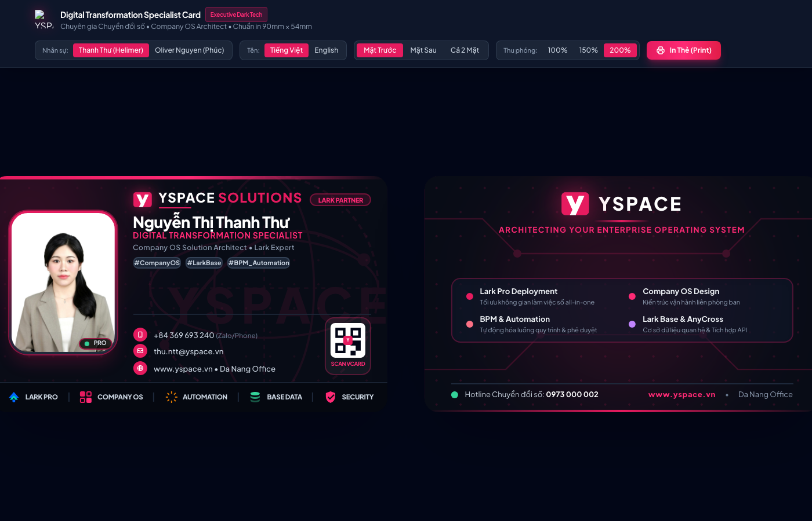

# YSPACE &bull; Digital Transformation Specialist Business Card

[](https://phucbigdata.github.io/yspace-business-card/)
[](https://phucbigdata.github.io/yspace-business-card/)
[](https://tailwindcss.com/)
[](https://phucbigdata.github.io/yspace-business-card/)

> **Executive Dark Tech Edition** dành riêng cho Chuyên gia Tư vấn Chuyển đổi số & Kiến trúc sư Giải pháp Company OS tại **YSPACE SOLUTIONS** (`#E61B5F`).

---

## 🌐 Trải nghiệm trực tiếp (Live Demo)

👉 **Xem danh thiếp trực tuyến:** [**https://phucbigdata.github.io/yspace-business-card/**](https://phucbigdata.github.io/yspace-business-card/)



---

## ✨ Điểm nổi bật & Tính năng (Features)

* **Thiết kế chuẩn tỉ lệ quốc tế (90mm &times; 54mm):** Tối ưu 100% cho in ấn danh thiếp vật lý lẫn chia sẻ số.
* **Ngôn ngữ thiết kế Executive Dark Tech:**
  * Gam màu thương hiệu độc quyền YSPACE: **`#E61B5F`** (Crimson / Magenta) kết hợp nền **Obsidian Dark `#080C16`**.
  * Hiệu ứng viền phát sáng ánh sáng động (**Cyber Border**).
  * Watermark mờ mạch vi xử lý và tọa độ không gian số.
* **Hỗ trợ đa nhân sự (Multi-profile Switcher):**
  1. **Nguyễn Thị Thanh Thư (Helimer Haluy)** &bull; Digital Transformation Specialist
  2. **Oliver Nguyen (Nguyễn Ngọc Phúc)** &bull; Company OS Solution Architect & Lark Expert
* **Chuyển đổi ngôn ngữ linh hoạt:** Nút chuyển tức thì giữa tên Tiếng Việt và Tiếng Anh.
* **Bộ điều khiển tương tác trực tiếp trên Web:**
  * Xem Mặt Trước, Mặt Sau, hoặc Cả 2 Mặt song song.
  * Thu phóng chi tiết 100%, 150%, 200%.
  * Nút in thẻ trực tiếp (**Window Print**) chuẩn vector không viền thừa.
* **Smart Contact & vCard:**
  * Tích hợp mã QR vCard để đối tác quét và lưu liên hệ ngay vào điện thoại.
  * 5 huy hiệu năng lực số: **Lark Pro, Company OS, Automation, Base Data, Security**.

---

## 🛠️ Công nghệ sử dụng (Tech Stack)

* **HTML5 Semantic & Responsive Canvas**
* **Tailwind CSS (JIT Engine)**
* **Google Fonts (Plus Jakarta Sans)**
* **Vector SVG Icons & Embedded Data URI Assets** (Hoạt động độc lập 100%, không lo lỗi đường dẫn)
* **CSS Paged Media Module** (`@page { size: 90mm 54mm; margin: 0; }`)

---

## 🚀 Hướng dẫn mở cục bộ (Local Usage)

Chỉ cần mở tệp `index.html` trong bất kỳ trình duyệt nào:
```bash
open index.html
```

Hoặc khởi chạy máy chủ HTTP:
```bash
python3 -m http.server 3000
```
Truy cập: `http://localhost:3000`

---

## 📄 Bản quyền (License)
&copy; 2026 YSPACE SOLUTIONS. All rights reserved.
